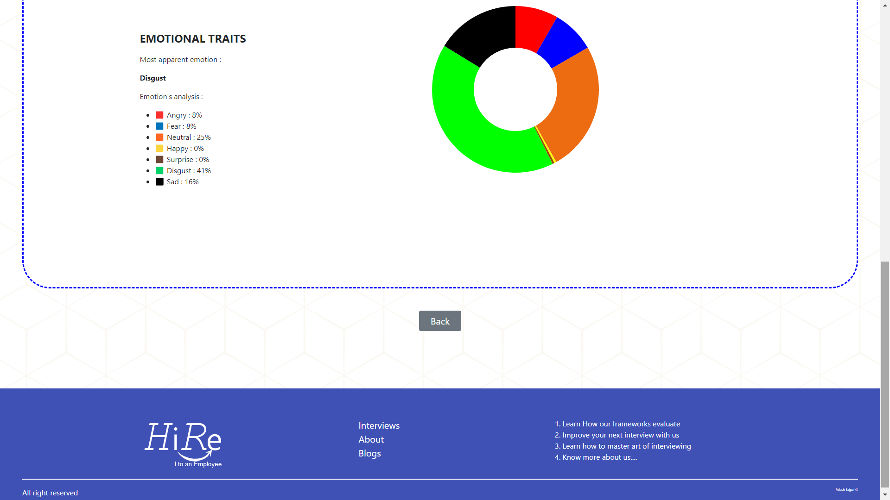

# Interview Score Prediction

It is a suggestion-based interview analysis tool that can help companies
to score candidates based on lexical and prosodic features.

HiRe is an AI-based interview analysis tool specialized for HR interviews that evaluate candidates based on lexical and prosodic characteristics. 

<p align="center">
  
</p>

## Run Locally

Clone the project

```bash
  https://github.com/PALASH-BAJPAI/interview-score-prediction.git
```

Go to the project directory

```bash
  cd App
```

Start the server

```bash
  python main.py
```

<br/>

## 🛠 Technologies
<ul>
  <li>Python</li>
  <li>Keras</li>
  <li>Tensorflow</li>
  <li>Flask</li>
  <li>Html</li>
  <li>CSS</li>
  <li>JavaScript</li>
  <li>D3.js</li>
</ul>

<br/>

## Dataset

**Audio Dataset**

For the audio dataset, we have used the Ryerson Audio-Visual Database of Emotional Speech and Song (RAVDESS). 

**Text Dataset**

To train our lexical model we used a Stream-of-consciousness data set created during the study of language styles by Pennebaker and King. 
To earn points they used the Big Five innovation techniques to select the best features to score human goals.  


**Final Score Dataset**

We used MIT dataset from the paper 'Automated Analysis and Prediction of Job
Interview Performance', We used this dataset for model which is used to generate final score.


<br/>

## Methodology

<p align="center">
  
</p>


**Input**: An audio and text answer to a question <br/>
**Output**: It would be a score given to each candidate out of 100


<br/>

## Demo

**HOME PAGE**
<p align="center">
  
</p>

<br/>

**PLATFORM PAGE**
<p align="center">
  
</p>

<br/>

<p align="center">
  
</p>


<br/>

**INTERVIEW PAGE**
<p align="center">
  
</p>

<br/>

<p align="center">
  
</p>

<br/>

<p align="center">
  
</p>

<br/>

**RESULT PAGE**
<p align="center">
  
</p>

<br/>

<p align="center">
  
</p>


## Feedback

If you have any feedback, please reach out to us at palashbajpai45@gmail.com

